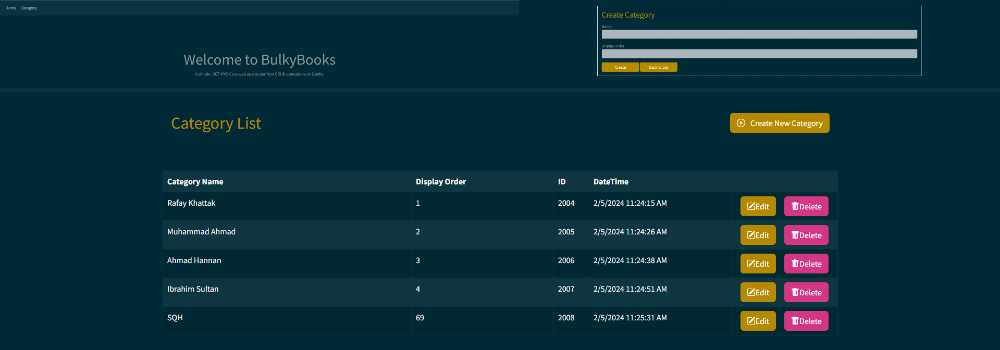

# Bulky Book

Bulky Book is an Blazor ASP.NET Core MVC application for managing categories with a SQL Server database backend.

 <a href="linko-app.herokuapp.com/" ><br></a>

## Getting Started

### Installation
1. Clone the repository: `git clone https://github.com/your-username/BulkyBookWeb.git`
2. Navigate to the project directory: `cd BulkyBookWeb`
3. Restore dependencies: `dotnet restore`
4. Update database: `dotnet ef database update`
5. Run the application: `dotnet run`

## Project Structure

- **BulkyBookWeb**
  - `Controllers`: Contains controllers handling HTTP requests.
  - `Data`: Defines the database context and migrations.
  - `Migrations`: Database migration files.
  - `Models`: Data models used in the application.
  - `Views`: Razor views for the application.
  - `wwwroot`: Static files (CSS, JavaScript, images).
  - `appsettings.json`: Configuration file for the application.
  - `Program.cs`: Entry point for the application.
  - `Startup.cs`: Configures services and middleware.

## Configuration

### AppSettings
The `appsettings.json` file contains configuration settings for the application.

```json
{
  "Logging": {
    "LogLevel": {
      "Default": "Information",
      "Microsoft.AspNetCore": "Warning"
    }
  },
  "AllowedHosts": "*",
  "ConnectionStrings": {
    "DefaultConnection": "Server=(localdb)\\MSSQLLocalDB;Database=Bulky;Trusted_Connection=True;"
  }
}
```

## Features
1. Create, Read, Update, and Delete (CRUD) operations for categories.
2. Display a list of categories with details.

## Entity Framework
This project uses Entity Framework Core for database operations. Entity Framework simplifies database interactions and allows for easy migrations.
